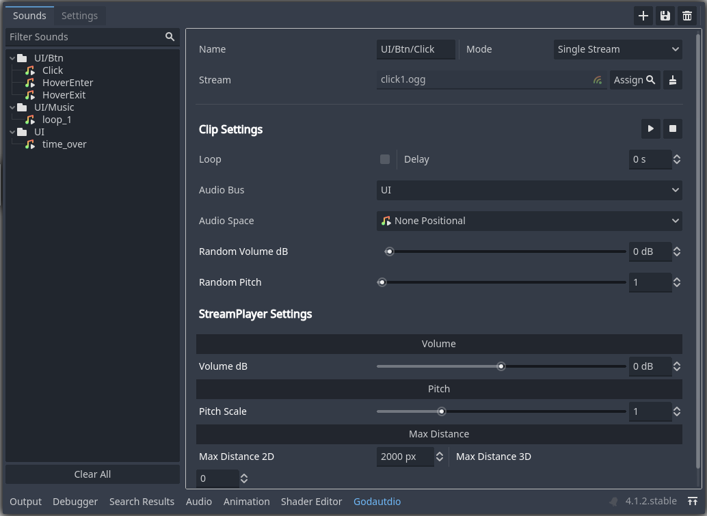
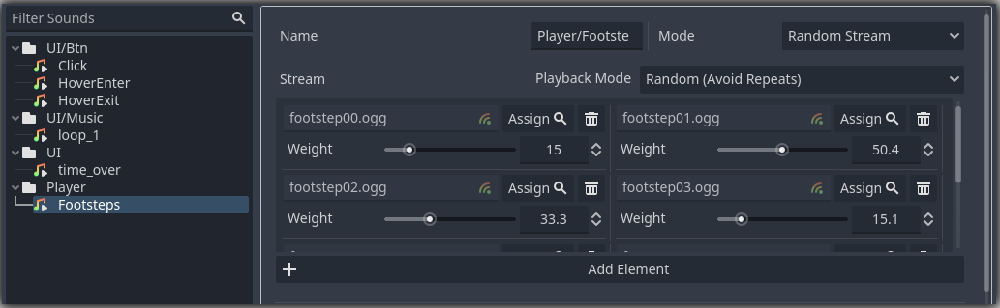
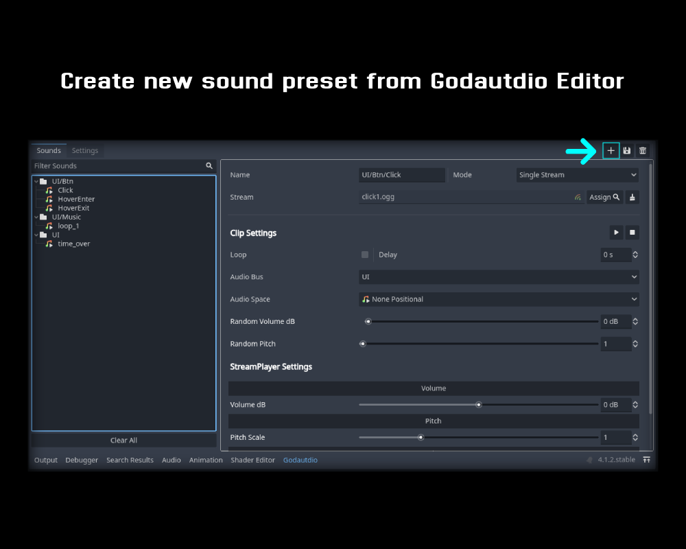
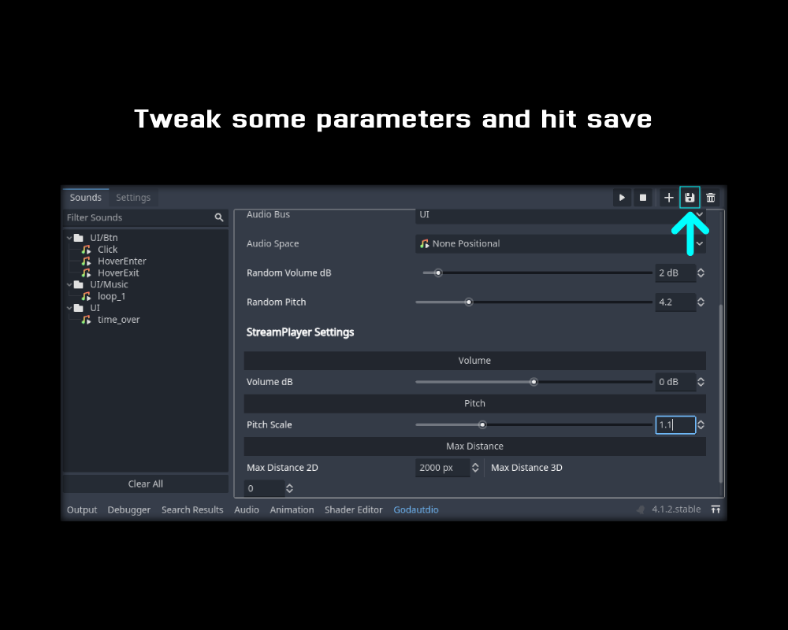
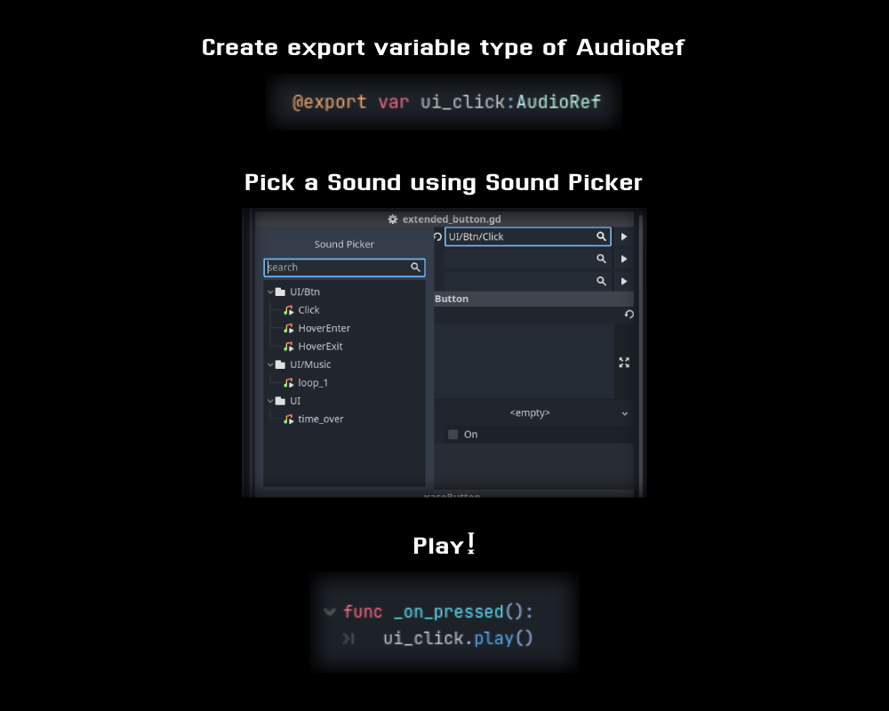

## What Is Godautdio?
Godautdio is a simple audio management plugin for the Godot game engine, designed to simplify and enhance audio handling within your game. With Godautdio, you can easily integrate and control audio playback, manage audio resources for your projects.





## Installation

1. Download the repo
2. Copy the `addons/Godautdio` directory to your project's `res://addons/` directory.
3. Enable the plugin under Project Settings -> Plugins -> Godautdio

## How To Use





# API

## AudioRef Class

The `AudioRef` class is a container to hold reference to audio sound on Godautdio Audio Library 

### Class Definition

- **Inherits**: Resource
- **Class Name**: AudioRef

### Properties

- `clip_path`: String
  - Description: The path to the audio clip in godautdio audio library.
- `last_play`: Godautdio.RefResult
  - Description: The result of the last play operation for this audio reference.
- `instance_id`: String
  - Description: The unique identifier of the audio instance associated with this reference.

### Methods

- `play(free_on_finish: bool = true) -> Godautdio.RefResult`
  - Play the audio reference. Optionally, you can specify whether the instance should be freed after finishing playback.
- `play_attached(parent: Node, free_on_finish: bool = true) -> Godautdio.RefResult`
  - Play the audio reference and attach it to a parent node. You can also specify whether the instance should be freed after finishing playback.
- `stop() -> Godautdio.RefResult`
  - Stop the playback of the audio reference.
- `play_at_location(position: Vector3) -> Godautdio.RefResult`
  - Play the audio reference at a specific 3D location. Useful for spatial audio.
- `play_one_shot() -> Godautdio.RefResult`
  - Play the audio reference as a one-shot sound. This is typically used for short, non-looping sounds.
- `is_playing() -> bool`
  - Check if the audio reference is currently playing.
- `clear()`
  - Remove the reference from the Godautdio audio manager, stopping its playback.


### Signals (To be implemented)

- `on_finish`: Signal emitted when the audio reference finishes playing.
- `on_stopped`: Signal emitted when playback of the audio reference is manually stopped.
- `on_canceled`: Signal emitted when playback of the audio reference is canceled.
- `on_loop_finished(current_loop: int)`: Signal emitted when a loop of the audio reference finishes playing. The `current_loop` parameter indicates which loop just finished.

### Usage

The `AudioRef` class is used to hold a reference to audio in Godautdio audio library. You can create instances of `AudioRef` to represent audio path and manipulate their playback as needed. The methods provided by the class allow you to start, stop, and control audio playback in various ways.

### Example

```gd
# Create an instance of AudioRef
var jump_sfx = AudioRef.new()
jump_sfx.clip_path = "sfx/player/jump"

# Play the audio
var result = jump_sfx.play()
```

## Godautdio Singleton API

| Class / Method              | Description                                                                                                                                                                        |
|-----------------------------|------------------------------------------------------------------------------------------------------------------------------------------------------------------------------------|
| `Godautdio`                 | The main class for audio management in Godautdio.                                                                                                                                      |
| `reload_db()`               | Reloads the audio library.                                                                                                                                                         |
| `editor_clip_preview(clip: AudioClip)` | Preview an audio clip in the editor.                                                                                                                                      |
| `editor_preview(ref: AudioRef)` | Preview an audio reference in the editor.                                                                                                                                      |
| `setup_editor_instance(clip: AudioClip)` | Sets up an audio instance for editor preview.                                                                                                                          |
| `stop_editor_preview()`      | Stops the editor audio preview.                                                                                                                                                   |
| `play_by_path(path: String, parent: Node = null)` | Plays an audio clip by its path.                                                                                                                               |
| `play(ref: AudioRef, parent: Node = null, free_on_finish: bool = true)` | Plays an audio by its path reference.                                                                                                                                   |
| `play_one_shot(ref: AudioRef, parent: Node = null)` | Plays an audio its path reference as a one-shot.                                                                                                                 |
| `play_at_location(ref: AudioRef, target_position: Vector3)` | Play the audio at a specific 3D location. Useful for spatial audio.                                                                                                      |
| `stop(ref: AudioRef)`       | Stops audio playback for an audio reference.                                                                                                                                       |
| `stop_ref(instance: String)` | Stops audio playback for a specific audio instance.                                                                                                                                |
| `stop_all()`                | Stops playback for all audio instances.                                                                                                                                            |
| `is_playing(ref: AudioRef)` | Checks if an audio reference is currently playing.                                                                                                                                  |
| `erase_ref(ref: AudioRef)`  | Erases an audio reference.                                                                                                                                                         |
| `clear()`                   | Stops all audio playback and clears the audio manager.                                                                                                                            |
| `set_clip_loops(instance_id: String, loops: int)` | Sets the number of loops for an audio instance.                                                                                                                        |
| `set_clip_delay(instance_id: String, delay: float, result: RefResult)` | Sets a delay for audio playback.                                                                                                                              |
| `set_bus_volume(volume: float, bus_name: String)` | Sets the volume for a specific audio bus.                                                                                                                                         |
| `StreamState`               | Enum representing the state of an audio stream.                                                                                                                                   |
| `RefResult`                 | Class for storing and manipulating audio operation results.                                                                                                                      |

